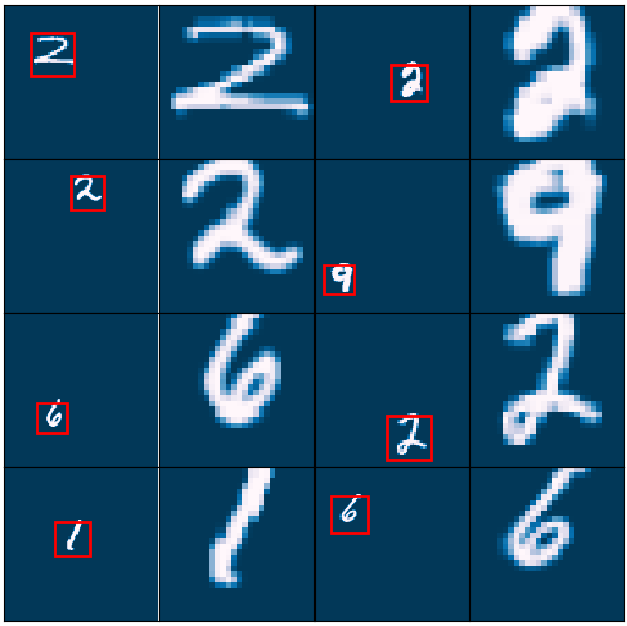
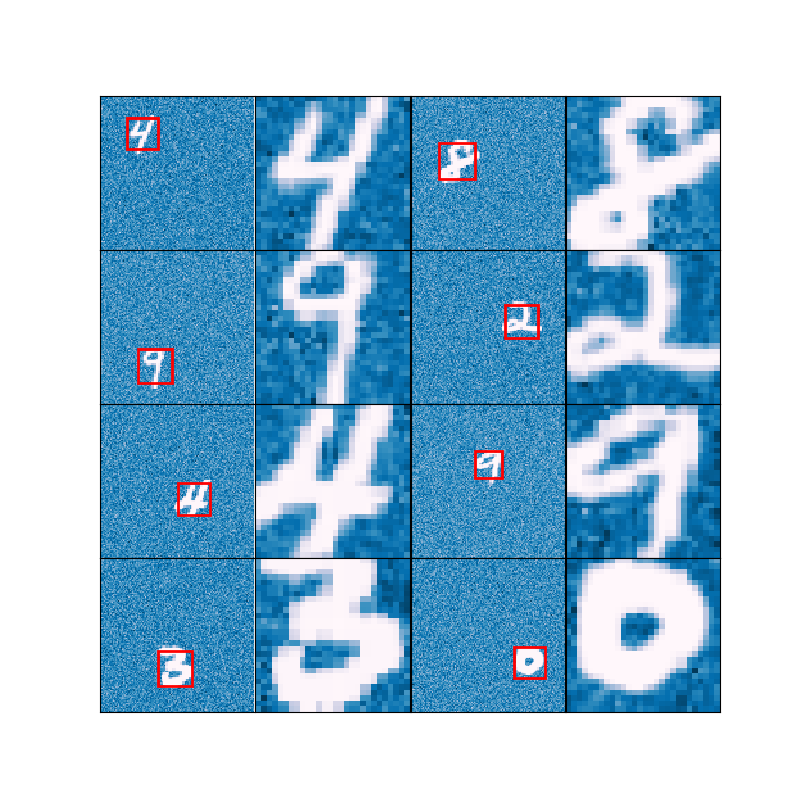

# Differentiable Hard Attention Module

This module shifts and scales the input image into a fixed sized image in a smart way. This is a modified version of [Spatial Transformer Networks](https://arxiv.org/abs/1506.02025). In their paper, they used another convolutional network to obtain transform parameters. Unlike the original paper, DHAM extract transform parameters with a 1 or 2 convolutional layers without pooling instead of a whole convolutional network. Yet, DHAM uses a weeker transform just to attend on the image, since the objective is to find a region of interest on the input image.

\begin{equation}
\begin{pmatrix}
  x_{i}^{s}  \\
  y_{i}^{s}  \\ 
\end{pmatrix} = \begin{bmatrix}
  s & 0 & t_{x} \\
  0 & s & t_{y} \\
\end{bmatrix} \begin{pmatrix}
  x_{i}^{t}  \\
  y_{i}^{t}  \\
  1 \\
\end{pmatrix}
\end{equation}

S for scaling and tx, ty are for shifting the attention region. A network with this module can be seen below.

On the above image, there are three convolutional layers before transformation. The third convolutional layer uses spatial softmax as the activation function. This output can be seen as the probability mass function(pmf) in which DHAM performs expected value and expected norm operations to find transform parameters. Scale parameter "s" is obtained by expected L1 or L2 norm and translation parameters are obtained by expected value over indexes of the pmf map.

After these parameters are obtained we can use the transformation mentioned in [STN](https://arxiv.org/abs/1506.02025). They use bilinear transformation to ensure differentiability of the transformation.

Since Dham only uses convolutional layers it can transform the arbitrary-sized input image into a fixed size region. So, there is no limitation of input image's spatial dimensions while training or testing.

## Experiments
___
In order to test the module, we used a modified version of the MNIST dataset. We first randomly rescaled the image then randomly sifted on a 120 by 120 map. While training we observed the attention regions as shown below.

Input images and regions of interest for 8 image in a single batch after a few iteration. The input image is 120 by 120 while the transformed images are 28 by 28. There are two convolutional for the module.

Note that, the only objective of the whole network is to classify digits. There is no axillary tasks or losses for attention. The network needs to attend to a proper region in the image in order to classify well.

The above example was quite easy to attend since in the input image there is nothing but the digit. Therefore, we also performed this experiment with a noisy background.

While experimenting with the noisy background, we observed that the number of channel of the convolutional layers for the module needs to be increased when the noise level (SNR) increases. In another word, complicated input images require deeper or wider convolutional layers for attention module.

## Requirements
___

* Pytorch (0.3.0)
* Numpy
* Matplotlib

